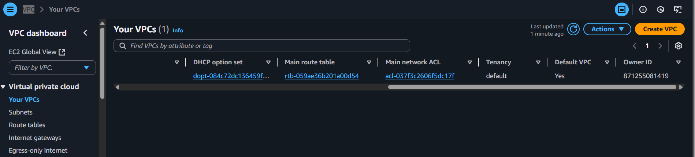

# Getting Started with AWS Networking: Understanding VPCs and Subnets

In modern cloud computing, efficient and secure network architecture is crucial to the success of scalable and resilient applications. Amazon Web Services (AWS) provides a robust set of networking tools that allow users to customize and control their cloud environments. At the heart of this architecture are two foundational components: Virtual Private Clouds (VPCs) and subnets.

This project aims to provide a clear and practical understanding of how VPCs and subnets operate within the AWS ecosystem. While networking in the cloud may initially appear complex, VPCs and subnets are designed to be both powerful and flexible, offering users granular control over IP addressing, routing, internet access, and network isolation.

Whether you are new to AWS or have previous experience, gaining a solid grasp of these concepts is essential for architecting secure, high-performance cloud environments. This document will explore how VPCs and subnets function, the benefits they offer, and how they can be effectively used to manage traffic flow, isolate resources, and secure your infrastructure.

Objectives of this project:

- To explain the core concepts and structure of AWS VPCs
- To differentiate between public and private subnets and their use cases
- To describe how VPCs and subnets interact with other AWS networking components (e.g., internet gateways, NAT gateways, route tables)
- To offer best practices for designing efficient and secure network topologies in AWS

By the end of this project, readers will have a comprehensive understanding of the role of VPCs and subnets in AWS networking and how to implement them to support a wide range of cloud-based projects — from simple web deployments to complex enterprise-grade infrastructures.

# What is an Amazon VPC?

Think of an Amazon Virtual Private Cloud (VPC) as your personal, customizable section of the AWS cloud—like having your own gated neighborhood in a vast city. Within this private network, you can launch and manage AWS resources such as virtual servers (EC2 instances), databases, and other services. You have complete control over the network environment, including the ability to define IP address ranges, create subnets, configure route tables, and set up firewalls using security groups and network ACLs (Access Control Lists).

This level of control ensures that only authorized traffic can flow in and out of your resources, making it secure and isolated—perfect for hosting sensitive or mission-critical applications.

Steps to Set Up a VPC and Configure Key Network Components
When setting up networking in AWS, you'll typically go through a few essential stages:

1. The Default VPC
2. Creating a new VPC
3. Creating and configuring subnets

## The Default VPC
The default Virtual Private Cloud (VPC) is a pre-configured networking environment automatically provisioned by AWS in each region. It provides a ready-to-use infrastructure that enables users to deploy applications and services immediately without the need for initial network configuration. The default VPC includes pre-assigned IP address ranges, public subnets, route tables, security groups, and an internet gateway, offering a functional baseline for general use. While it is designed to facilitate quick deployment, all components of the default VPC can be customized to meet specific network and security requirements.

 So this is the first page to see when click on 'Your VPC'. After that make sure to check the location is in the right place as you see below:

## Creating a new VPC
To gain a clear understanding of the individual components involved in building a Virtual Private Cloud (VPC), we begin by selecting the "VPC only" option. This approach enables a manual setup, allowing us to configure each element step by step. In this configuration, we name the VPC "TGCD1-vpc" and assign it the IPv4 CIDR block "10.0.0.0/16", which serves as the primary address range for all resources within the VPC. This block offers a wide range of private IP addresses suitable for scalable deployments.

AWS also provides the option to associate a secondary CIDR block with a VPC, such as "10.64.0.0/16". This feature is particularly useful in scenarios where the existing IP range is insufficient or when connecting to another VPC with overlapping IP space. In such cases, adding a secondary block allows continued growth and enables VPC peering without reconfiguring the entire network. This method offers both flexibility and efficiency in handling complex networking requirements. See this blog post on how a secondary CIDR block is being used in an overlapping IP scenario: [https://aws.amazon.com/blogs/networking-and-content-delivery/how-to-solve-private-ip-exhaustion-with-private-nat-solution/](https://aws.amazon.com/blogs/networking-and-content-delivery/how-to-solve-private-ip-exhaustion-with-private-nat-solution/)

 
This image is seen after clicking on the 'Create VPC'. We can add mote tag, but here we left it as default, after which we click on `CREATE VPC` for tge last time. As soon as the VPC is created, it's assigned with a vpc-id and there's a route table created that serves as the main route table - rtb-034f3b111e7c692bc in below image: 

The next thing to do is the subnet as the VPC has been created succefully. 

## Subnets 
Subnets are subdivisions within a Virtual Private Cloud (VPC) that allow for better organization and management of cloud resources. They function like designated sections within an office building, with each section representing a specific department. This segmentation helps structure the network efficiently, enabling more precise control over resource placement, accessibility, and traffic flow.

Now we'er going to create a subnet, step by step. 
Go to VPC > Subnets > Create Subnets and we select the VPC that we've created previously - the TGCD1-vpc or anything you tagged your VPC

We enter the subnet setting details, click on add new subnet and the click **Create subnet**. We always make sure not to forget choosing a zone, if not, AWs would randomly give us any zone.

After creating the subnets, they should now be visible in the AWS Management Console under the specified VPC. If any subnets are missing, they can be manually added by creating a new subnet and associating it with the intended VPC. At this stage, it is possible to launch EC2 instances within the VPC by selecting any of the configured subnets. However, it is important to note that although a public subnet has been designated, it currently does not have Internet access. Upon inspecting the route configuration for the public subnet, it is evident that it is still using the main route table, which only includes a local route. There is no default route (0.0.0.0/0) configured to direct traffic to an internet gateway, and as such, external connectivity is not yet established.
 This image shows the subnet has been created successfully and as you can see, we have two private and two public.

## Understanding Public and Private Subnets in AWS VPC
In the world of AWS VPC, think of subnets as individual plots in your hectre of land (VPC). Some of these plots (subnets) have direct road access (internet access) - these are public subnets. Others are more private, tucked away without direct road access - these are private subnets. Now let's see how to cteate both subnets

### Creating a Public Subnet
Creating a public subnet is like creating a plot of land with direct road (internet) access. Here's how you do it:

- Go to the AWS VPC page.
- Find 'Subnets', click on it, then click 'Create subnet'.
- Give this new plot a name, select the big plot (VPC) you want to divide, and leave the IP settings as they are.
- Attach an Internet Gateway to this subnet to provide the road (internet) access.
- Update the route table associated with this subnet to allow traffic to flow to and from the internet.

### Creating a Private Subnet
Creating a private subnet is like creating a secluded plot without direct road (internet) access. Here's how you do it:

- Go to the AWS VPC page.
- Find 'Subnets', click on it, then click 'Create subnet'.
- Give this new plot a name, select the big plot (VPC) you want to divide, and leave the IP settings as they are.
- Don't attach an Internet Gateway to this subnet, keeping it secluded.
- The route table for this subnet doesn't allow direct traffic to and from the internet.
## Working with Public and Private Subnets
Public subnets are great for resources that need to connect to the internet, like web servers. Private subnets are great for resources that we don't want to expose to the internet, like databases.

Understanding public and private subnets helps us to organize and protect our AWS resources better. We always remember, use public subnets for resources that need internet access and private subnets for resources that we want to keep private.

As we have done VPC and then created subnets, the next chapter would talk about internate gateways and routing table.