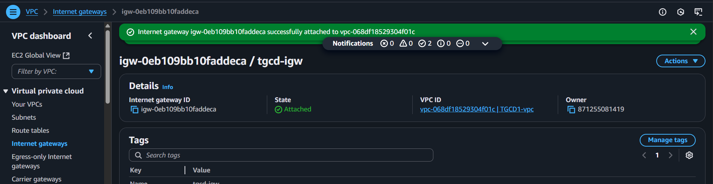
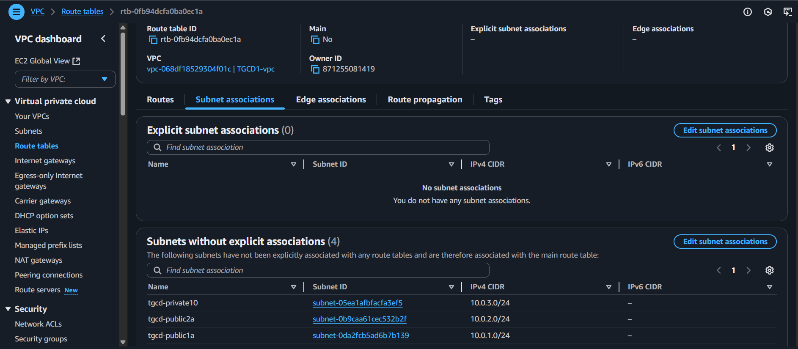

### Introduction to Internet Gateway and Routing Table

In a Virtual Private Cloud (VPC), establishing communication with external networks requires specific components, much like how a real-world city relies on infrastructure for connectivity. In this context, the **Internet Gateway** functions as the entry and exit point for internet traffic, while the **Routing Table** serves as the navigation system that directs traffic to its intended destination.

### Understanding the Internet Gateway

An **Internet Gateway** in AWS acts as the connection between a VPC and the internet. Without it, resources within the VPC, including those in public subnets, remain isolated from external networks. This gateway enables both inbound and outbound communication between AWS resources and the broader internet.

### Configuring Internet Access

To enable internet access for instances placed in a public subnet, an Internet Gateway must first be created and then attached to the corresponding VPC. This gateway serves as the main conduit for internet traffic. Following its attachment, routing tables must be updated to include a default route (0.0.0.0/0) that directs outbound traffic through the Internet Gateway. This configuration is essential for allowing instances in the public subnet to communicate beyond the VPC boundary.

**Creating an Internate Gateway**

Go to VPC > Internet gateways and click "Create internet gateway"

We put a name tag and click create internet gateway

After that we click on attach the IGW to the TGCD1-vpc, then select the VPC.
 Then we select the VPC

After this, we see from the image below that it ahs been attached successfully. 

To maintain the privacy and isolation of resources within the private subnets, it is essential that these subnets do not have a default route to the internet. This ensures that any instances deployed in the private subnets remain inaccessible from external networks, adhering to best practices for secure architecture.

## Routing Table
A Routing Table in AWS functions as a set of directions for network traffic within a Virtual Private Cloud (VPC). Similar to how a GPS or map guides people to their destinations, a routing table defines how packets should be forwarded between subnets and to external networks. For example, if traffic originating from a resource in the VPC is intended for the internet, the routing table will direct it to the appropriate path, such as an Internet Gateway.

## Creating and Configuring a Routing Table for Public Subnets
With the Internet Gateway in place, the next step is to provide clear routing instructions to public subnets through a dedicated routing table. This route table will ensure that public-facing resources can reach the internet while private resources remain isolated.

To begin, navigate to the Route Tables section in the AWS VPC console and create a new route table. Assign it a descriptive name, such as tgcd-vpc-public-rtb, and associate it with the appropriate VPC, in this case, TGCD1-vpc. Once created, the route table can be configured to include a default route (0.0.0.0/0) pointing to the Internet Gateway, thereby enabling internet access for any subnet associated with it. This configuration is a critical step in distinguishing public subnets from private ones within the same VPC.
So when we click on the route table we see this image
 Then we click on create route table and see this

from this image, edit the name and type **'tgcd-vpc-public-rtb'** then add a default route to the internet Gateway(IGW) by clicking the drop down arrow on the seconf roll as seen below, also leave the name tags as defualt as seen on the image. Click 'Add new tag' and repeate same process but the name now should be 'Private' **'tgcd-vpc-private-rtb'** and after that we click on the create route table as seen on the buttom right, which takes us to the next page seen below

The image above shows our route table has been created. Now the next step is to `Edit route` from the 'action' drop down arrow as seen above, which takes us to the next page

From the image above,we click on the drop down arrow and select 'Internet Gatway' and leave others by default as it appears, the click `save change` which takes us to the next page

Our routes have been updated as seen above, and active. Next is to select the **Subnet association** tab, and click on `Edit subnet association` as seen below

then save association after selecting two `tgcd-public` as seen and then save association. 

The images shows its now saved and our VPC is ready, now we can run EC2 instance in public subnets if they need internet access or in private subnets if they don't.

## Note:
**tgcd-vpc-public-rtb:** A route table with a target to Internet gateway is a public route table.

**tgcd-vpc-private-rtb:** A route table with a target to NAT gateway is a private route table.

We will also create the route table for for private but subnets and routes are not yet been attached to it as it's just only been created.

Now we have done this, we move over to **NAT Gateways**