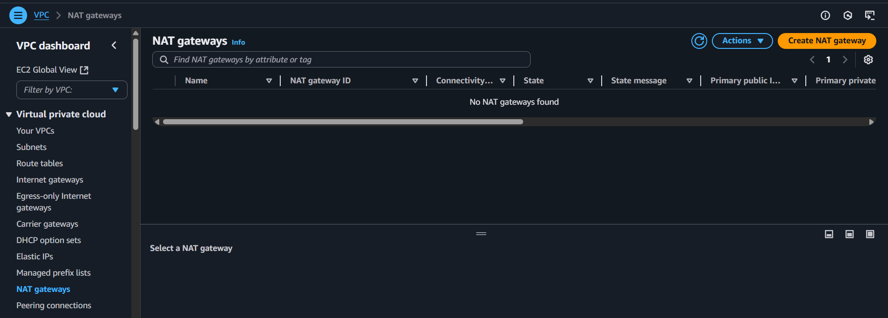
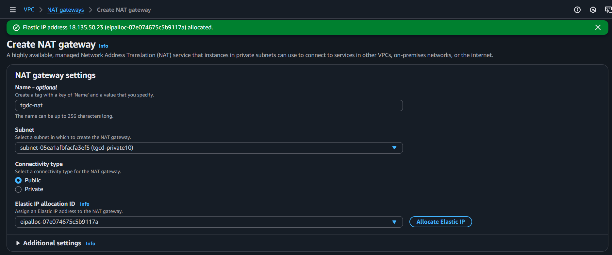
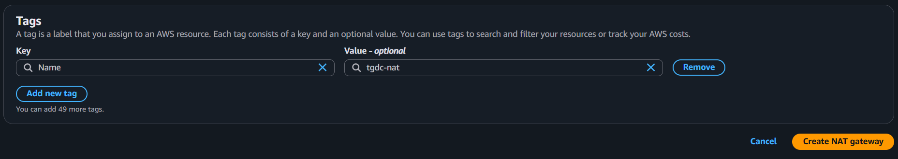
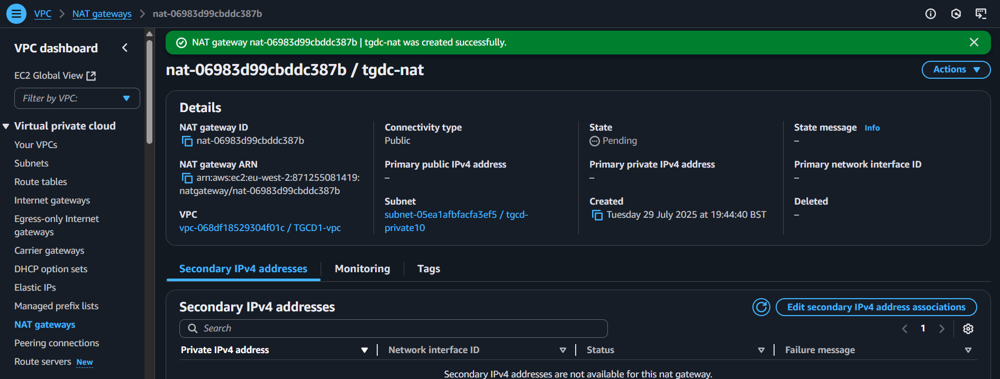
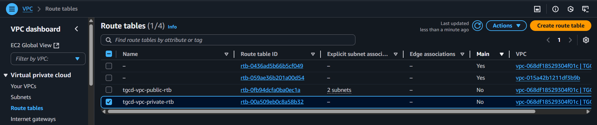
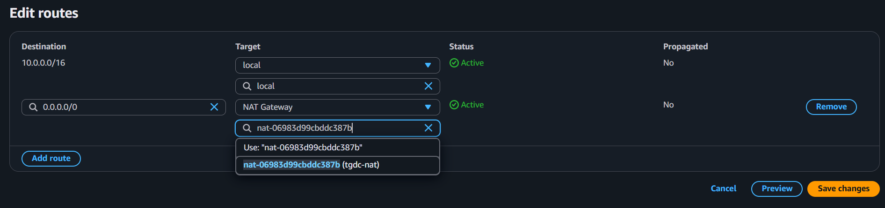
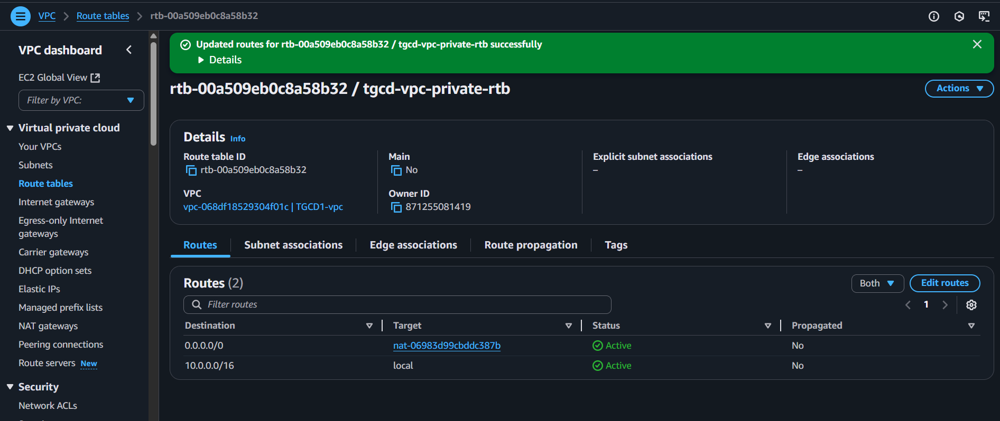
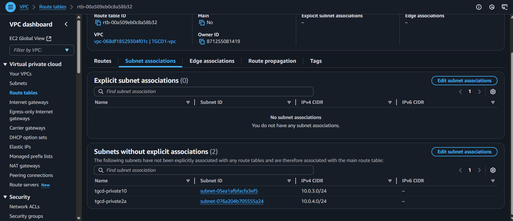
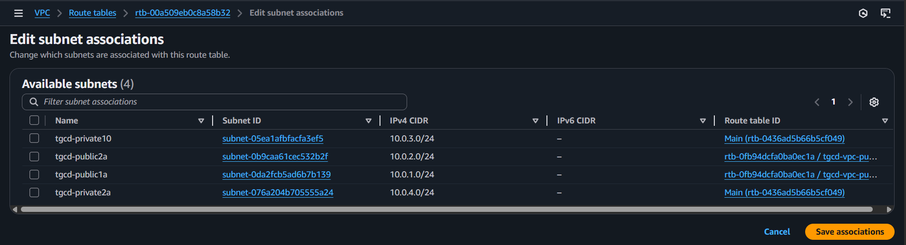

## Introduction to Private Subnets and NAT Gateway

In an AWS Virtual Private Cloud (VPC), **private subnets** are used to host resources that should remain isolated from direct internet access. These subnets provide a secure environment for sensitive components such as databases, application servers, or internal services. However, in some cases, these resources still require outbound internet access—for example, to download updates or communicate with external APIs. To enable this without compromising security, a **NAT Gateway** is used.

A private subnet can be compared to a secure room within your house (the VPC) that has no direct connection to the outside world. Any resources placed in this subnet, such as databases or internal applications, are shielded from external traffic and cannot be accessed directly over the internet.

### Understanding and Implementing a NAT Gateway

A **Network Address Translation (NAT) Gateway** serves as a controlled access point that allows instances within a private subnet to initiate outbound connections to the internet, while still preventing unsolicited inbound traffic. This ensures that internal resources can perform necessary operations, such as fetching software updates or communicating with external services, without being exposed to potential external threats.

To implement this configuration, a NAT Gateway must first be created and placed within a **public subnet** that has access to the internet via an Internet Gateway. Once the NAT Gateway is set up, a route must be added to the private subnet’s route table, directing all outbound internet-bound traffic (`0.0.0.0/0`) to the NAT Gateway. This setup maintains the integrity of the private subnet while providing the necessary internet access for its internal resources.
To create a NAT Gateway: Go to VPC > NAT Gateways 
 then click on `create NAT Gateway`
 from the image above, create the NAT Gateway named "tgcd-nat" under one of the private subnet which was choosen as tgcd-private10 as the subnet. Also allocate Elastic IP by clicking the `Allocate Elastic IP` tab as it's required fir the NAT gateway creation, 
 and then click on the create NAT gateway.
 here our NAT gateway have been created successfully.

Let's go to the route table menu and edit the private route table we created in _chapter2_, add a default route to the Network Address Translation (NAT) Gateway
 Choose tgcd-vpc-private-rtb, select `Edit routes`, and select `Add route`. Under the Target, select the NAT gateway named "tgcd-nat" as seen on the image and then save.

Next is to go to **"Subnet association"** tab 
 then click the **"Edit Subnet assocciation"**
 then choose the two private tgcd as seen below
. Afyer this, then click on `save association` and we are done with this part. 
We will take a little look at the differences between security groups and network access control list on the next chapter.

