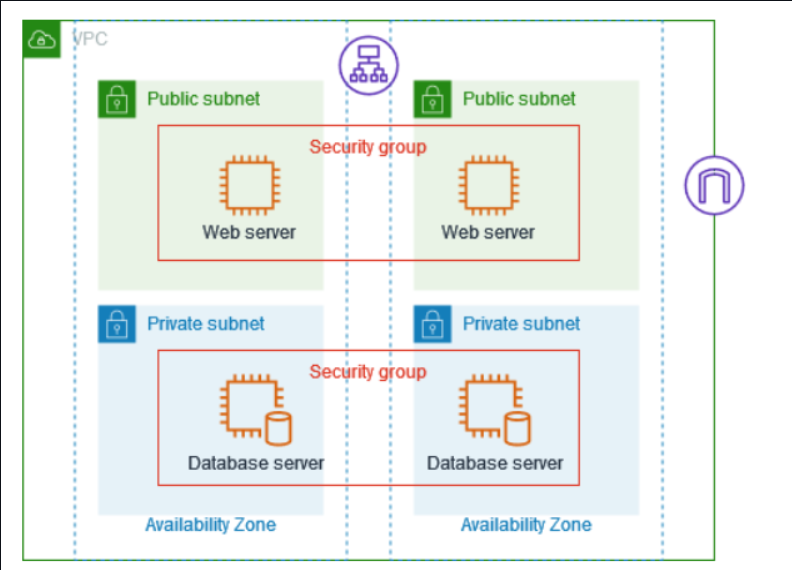
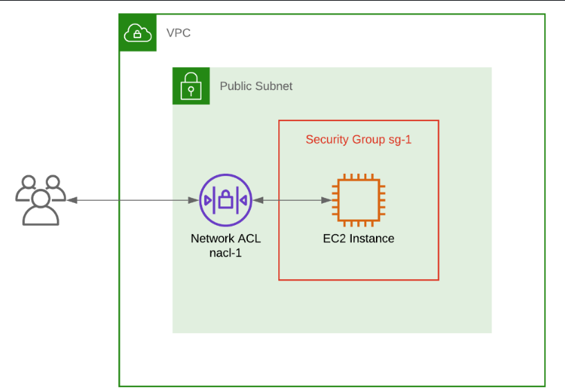
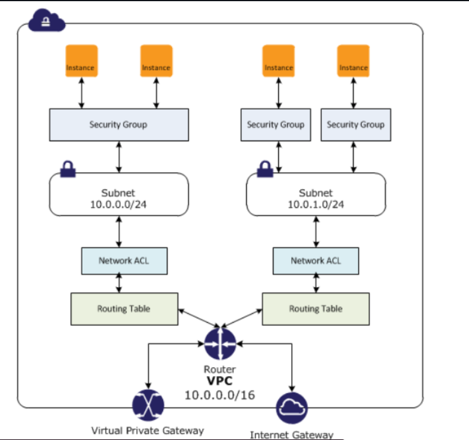

## Understanding the Differences between Security Groups and Network Access Control Lists

To secure your network on the AWS cloud, we need some important tools like Security groups and network ccess control lists (ACLs), but they definitely do different job or rather serve different purpose.

### Security Groups

In a cloud computing environment, **security groups** function as virtual firewalls that control inbound and outbound traffic to individual resources, such as EC2 instances. They can be likened to a **bouncer at a club**, responsible for ensuring that only permitted traffic is allowed to interact with your cloud-based infrastructure. In this analogy, the **club represents your cloud resources**, and the **bouncer represents the security group** standing guard at the entrance.

Just as a bouncer checks the IDs and credentials of individuals attempting to enter or leave a club, a security group evaluates network traffic based on **source IP addresses, protocols, and port numbers**. These traffic rules determine which types of communication are allowed to reach your instances and which should be blocked. For instance, a security group can be configured to permit **incoming HTTP traffic on port 80** to a web server, while denying all other unsolicited inbound connections. Similarly, outbound rules can be defined to allow traffic from your instance to a specific destination, such as an external database on a certain port, while restricting all other outbound access.

Security groups provide **stateful filtering**, meaning if a request is allowed in, the response is automatically allowed out—even if no outbound rule explicitly permits it. This stateful behavior simplifies configuration, particularly for services that require bidirectional communication.

These security rules are defined **at the instance level**, allowing for **fine-grained control** over access to each virtual machine or service. Multiple instances can share the same security group, or each instance can have a unique one, depending on the security requirements of your architecture. Security groups are **highly flexible** and can be modified at any time, enabling you to adapt your access control policies as your application evolves or new security needs arise.

By enforcing strict control over network traffic, **security groups serve as a critical defense layer**, safeguarding your resources from unauthorized access, potential exploits, or malicious activity. They are an essential part of any secure cloud architecture, providing visibility and control over how resources communicate both internally and with the outside world.

### Understanding Network ACLs in AWS

In AWS networking, **Network Access Control Lists (Network ACLs)** serve as a critical layer of security that governs traffic **at the subnet level**, acting much like a **security guard at the perimeter of a building**. In this analogy, the **building represents the subnet**, and the **network ACL functions as the guard**, checking every individual attempting to enter or leave.

Much like a physical guard checks identification and credentials before allowing someone into a secured area, a **network ACL inspects each packet of data** entering or exiting a subnet. It uses a defined set of rules based on **IP addresses, protocols, and port numbers** to determine whether specific traffic should be allowed or denied. This helps enforce a strong boundary around the subnet, preventing unauthorized or harmful data from accessing the resources within.

For example, a network ACL can be configured to allow **inbound SSH traffic on port 22** while blocking all other types of inbound connections. Likewise, it can permit **outbound traffic to a trusted IP range on a specific port**, while rejecting all other outbound requests. This precise control is particularly valuable in environments where compliance, auditing, or stringent access policies are required.

Unlike security groups—which are **stateful** and evaluate only the initial direction of a request—**network ACLs are stateless**, meaning they evaluate **each direction of traffic independently**. If you allow inbound traffic on a certain port, you must explicitly allow the corresponding outbound response, and vice versa. This stateless nature requires careful rule configuration but offers a higher level of control for securing traffic flows.

Network ACLs apply their rules to **all resources within a subnet**, making them an efficient way to enforce consistent access policies across multiple instances or services. They are particularly useful for scenarios where broader subnet-level protections are needed, such as isolating development environments, filtering traffic to databases, or protecting public-facing web tiers from certain IP ranges.

In summary, **Network ACLs operate as perimeter firewalls** at the subnet boundary. They examine and filter both incoming and outgoing traffic based on a clearly defined set of rules. By doing so, they act as an additional layer of defense in AWS architectures, working alongside security groups to enhance the overall security posture of your VPC by regulating access on a broader, subnet-wide scale.

To conclude, **security groups** and **network ACLs** are both essential components for securing your network in the AWS cloud, but they function at different layers and serve distinct purposes. **Security groups** operate at the **instance level**, acting like a **bouncer at a club**—they manage and filter inbound and outbound traffic for individual resources based on defined rules, ensuring only permitted traffic reaches specific instances. In contrast, **network ACLs** function at the **subnet level**, much like a **security guard at a building entrance**—they enforce traffic rules for all resources within a subnet, controlling both inbound and outbound traffic based on stateless, rule-based filtering. Together, they provide layered security and granular control over network access within a VPC.

***In the next chapter, we'll talk about VPC Peering and VPN Connection.***
