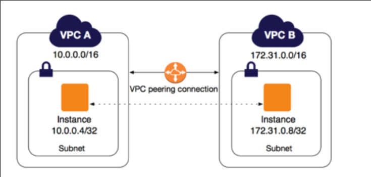
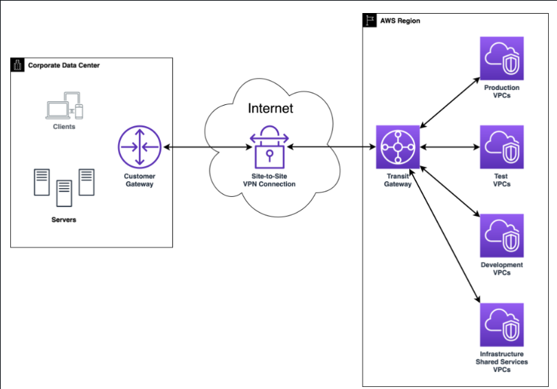
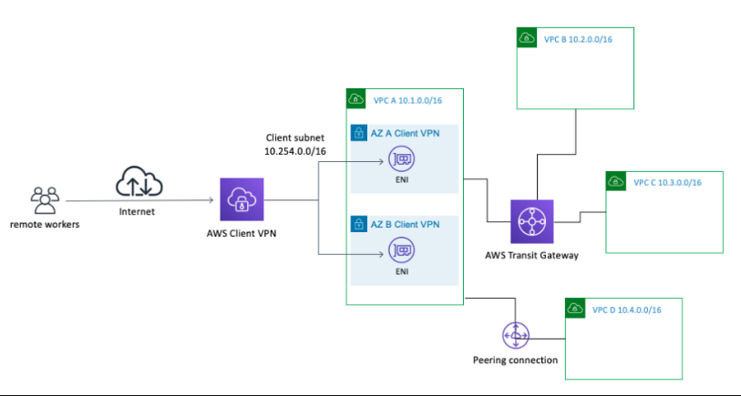

## VPC Peering ansd VPN Connection

The image below shows us a demo of what we'er talking about about `peering`

### VPC Peering: Connecting Cloud Networks Seamlessly

**VPC Peering** is a powerful networking feature in cloud environments, particularly within AWS, that allows two Virtual Private Clouds (VPCs) to be directly connected. These VPCs can belong to the same AWS account or different accounts, and can even exist in different regions, depending on the configuration. Once a peering connection is established, resources in each VPC can communicate with one another as though they are part of the same private network. This communication occurs over the cloud provider's internal infrastructure, which means it does not traverse the public internet—ensuring enhanced security and reliability.

VPC Peering is widely used in various scenarios such as multi-tier application deployments (e.g., separating web, application, and database layers across VPCs), centralized logging or monitoring services, cross-VPC database replication, and shared service environments where multiple VPCs need access to a common set of resources.

#### Key Advantages of VPC Peering

* **Simplified Network Topology**: VPC Peering reduces the need for complex VPNs or NAT gateways by allowing direct, point-to-point network connections between VPCs.
* **Efficient Resource Sharing**: Applications and services hosted in separate VPCs can interact directly, facilitating the efficient exchange of data and services across environments.
* **Enhanced Security**: Since all communication occurs within the cloud provider's private network, data remains secure and isolated from external threats.
* **High Performance**: VPC Peering supports low-latency, high-throughput communication, improving performance for applications that span multiple VPCs.
* **Cost-Effective**: It eliminates the need for costly additional infrastructure or third-party networking solutions, lowering data transfer and operational expenses.
- **Cross-Account Connectivity**
You can peer VPCs across different AWS accounts, enabling collaboration between separate business units, partners, or clients while maintaining isolated billing and governance boundaries.
- **Cross-Region Peering Support**
VPC Peering supports inter-region connections, allowing for global application architectures, disaster recovery setups, or latency-based routing solutions that span continents.
- **High Availability and Resilience**
VPC Peering is a fully managed service with no single point of failure. Once established, the connection is highly reliable and resilient, supporting critical workloads without requiring maintenance.
- **No Single Point of Congestion**
Unlike transit gateways or NAT gateways that could become bottlenecks if shared between multiple VPCs, VPC Peering is point-to-point, ensuring dedicated bandwidth between the two connected VPCs.
- **Support for Private Services**
VPC Peering enables access to internal services like private REST APIs (using AWS PrivateLink), internal load balancers, or custom DNS zones, fostering private microservice architectures.
- **Support for Hybrid Deployments**
When combined with VPN or Direct Connect, VPC Peering helps extend hybrid cloud environments by creating cohesive multi-VPC, multi-region topologies.
- **Granular Routing Control**
You have fine-grained control over which routes are propagated between peered VPCs using route tables. This ensures that only the required traffic is permitted, supporting segmented and secure network designs.

---

### Introduction to VPN Connections: Extending Your Network to the Cloud

**Virtual Private Network (VPN) connections** provide a secure, encrypted tunnel between your on-premises network and a cloud provider’s environment, such as an AWS VPC. This is especially valuable for organizations adopting a **hybrid cloud model**, where workloads are distributed between on-premises infrastructure and the cloud.

VPNs ensure that sensitive data remains protected while traversing public networks. They allow users or systems from a corporate network to access cloud-based resources securely, as if they were part of the same internal network.

There are primarily two types of VPN configurations in AWS:

* **Site-to-Site VPN**: This type of VPN connection establishes a secure link between your on-premises data center (or branch office) and the cloud provider’s VPC. It enables consistent, private communication between the two environments. Site-to-Site VPNs are typically used for hybrid deployments, backup and disaster recovery, secure cloud bursting, or to extend corporate services to the cloud.

2. **AWS Client VPN** AWS Client VPN provides secure remote access to the cloud network for individual users or devices. It enables secure connectivity for remote employees, partners, or contractors to access resources in the VPC securely.

### Benefits of VPN Connections

1. **Secure Remote Access**
   VPN (Virtual Private Network) connections allow remote employees, contractors, or branch offices to securely connect to cloud-hosted infrastructure (e.g., VPCs). By using authentication and encryption protocols, VPN ensures that only authorized users or systems can access your sensitive resources, greatly reducing the risk of unauthorized entry or data compromise.

2. **End-to-End Data Encryption**
   One of the most significant advantages of VPNs is the **encryption of data in transit**. VPNs use protocols like IPsec (Internet Protocol Security) or SSL/TLS to encrypt packets of data as they travel between your on-premises data center and the cloud. This ensures that even if the data is intercepted in transit, it remains unintelligible to unauthorized parties, protecting sensitive communications from eavesdropping and tampering.

3. **Flexibility and Workforce Mobility**
   VPN connections enable employees and IT teams to access cloud-based tools, services, and databases from anywhere in the world, using any secure internet connection. This flexibility is crucial in modern work environments where remote work, mobile access, and international collaboration are increasingly common. With VPN, productivity is maintained without compromising security.

4. **Hybrid Cloud Integration**
   VPN connections are a foundational component of **hybrid cloud architectures**, which combine on-premises infrastructure with public cloud environments. Site-to-Site VPNs allow for continuous, secure communication between these environments, enabling:

   * Seamless data exchange between legacy systems and cloud-based services.
   * Gradual migration of applications and workloads to the cloud.
   * High availability and disaster recovery strategies across both environments.

5. **Rapid Deployment and Scalability**
   Unlike leased lines or direct physical connections, VPNs can be set up quickly without extensive hardware investments. This allows businesses to scale connectivity as needed—adding new locations or users without the complexity or delays associated with traditional networking.

6. **Cost-Effectiveness**
   VPNs eliminate the need for expensive dedicated circuits (like MPLS) by leveraging the public internet for connectivity—while still ensuring data is secure. This makes VPN an attractive option for small and medium-sized businesses looking to maintain secure communication channels without breaking the bank.

7. **Support for Multi-Region Access**
   Cloud VPN services can be configured to connect to different geographic regions. This ensures consistent, secure access for global teams or distributed infrastructure, enabling a truly international footprint for cloud operations.

8. **Resilience and Redundancy**
   VPN connections can be configured with **failover and redundancy mechanisms**. For example, you can have multiple VPN tunnels or connections to different cloud regions or availability zones. If one tunnel fails, another can take over automatically, maintaining continuous uptime and business continuity.

9. **Centralized Security Management**
   VPNs can be centrally managed using tools like AWS CloudHub or third-party network management solutions. This centralization allows administrators to enforce consistent access policies, monitor traffic, and quickly revoke access if a device or user becomes compromised.

10. **Compliance and Regulatory Benefits**
    VPNs support compliance with industry regulations such as **HIPAA**, **GDPR**, or **PCI DSS** by ensuring encrypted communication channels and auditable secure access. For organizations handling sensitive or regulated data, VPNs help meet technical safeguard requirements.

---

In summary, both **VPC Peering and VPN Connections** serve critical but distinct roles in AWS networking. VPC Peering is ideal for connecting cloud networks internally, while VPNs provide secure pathways between cloud environments and external (on-premises) networks. Together, they offer the flexibility and security required for building robust, scalable, and hybrid cloud infrastructures.
